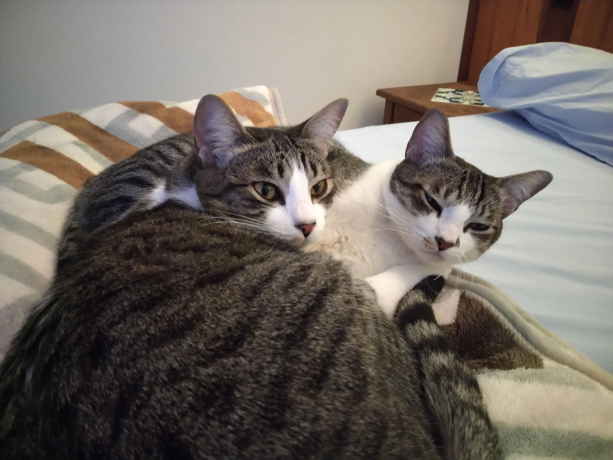
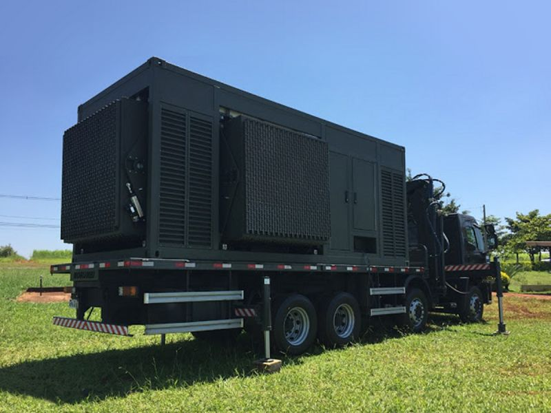
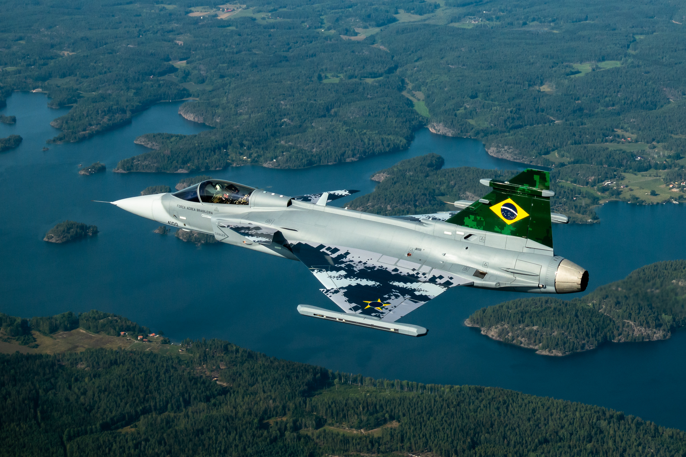
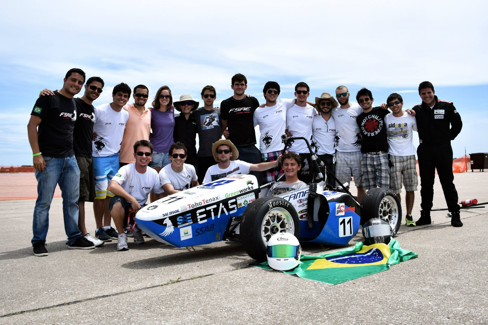
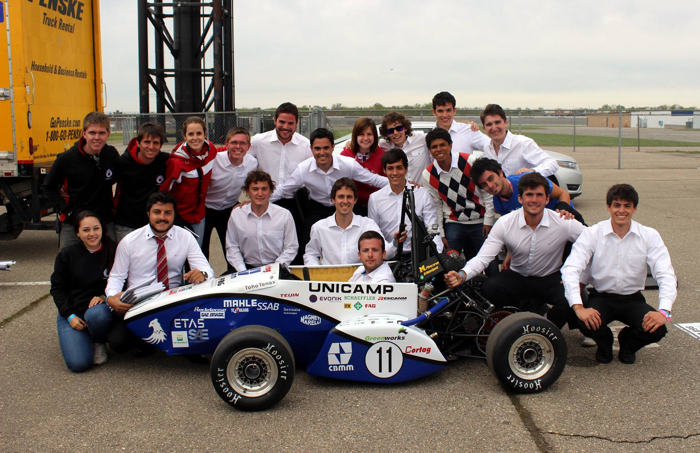

You can contact me at [h86267145@gmail.com](mailto:h86267145@gmail.com)

--- 
 

This website is all about my DIY projects. I intend on adding plans, thoughts, pictures.... Anything I feel is worth
sharing with the world.

--- 
 

They are always ready to help me in my projects

 *Seu Tonico e Dona Inezita*

---
 

For 7 years I worked for Embraer Defense & Security. I started as an intern developing embedded software for military
radars and was hired as a full time FPGA engineer. On the years I worked with digital systems I frequently developed
VHDL components, worked in electronics laboratory, debugging hardware and software, and also supported the process of
certifying one of the radars to MIL-STD-461.

 *Radar SABER M200*

---
 

I also worked for one year as a secondee at SAAB, in Linköping, Sweden. I was part of the Systems Engineering team, 
responsible for integrating electro-optical components into military aircrafts, managing requirements, safety analyses 
following ARP4761, equipment qualification, flight tests, rig tests etc.

 *SAAB JAS 39 Gripen E*

---
 

During my graduation I was part of a Formula Student team, when I was responsible for the electronics and data 
acquisition of the vehicle. I highlight the years of 2014 and 2015, when our team competed in the USA.

 *Lincoln 2014*

 *Michigan 2015*

I am currently an FPGA Design Engineer at Stoneridge, working mostly with embedded platforms for video applications to the
 automotive industry. 
